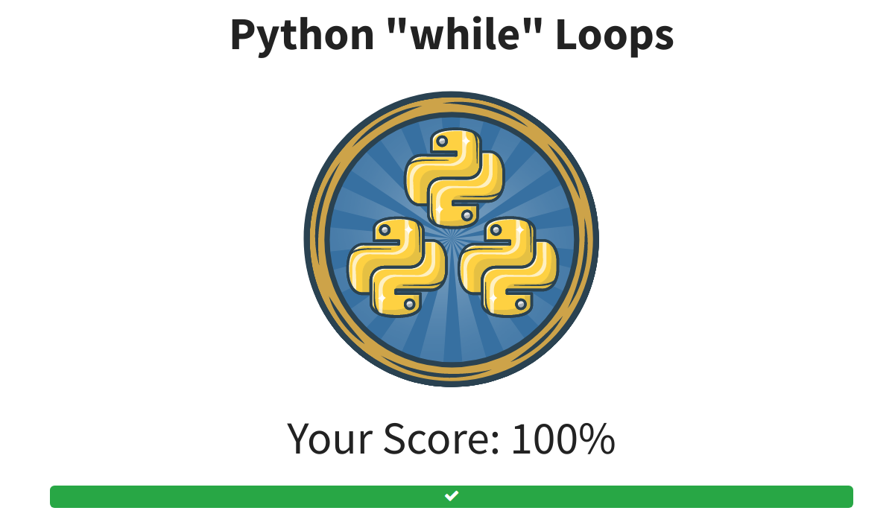

# Python Koans

This is a copy from [Python Koan](https://github.com/gregmalcolm/python_koans) as Flex Python learning practise.

The original `README.rst` file is moved to [TUTORIAL.rst](./TUTORIAL.rst).

Here will record my progress on this repo test cases and [RealPython](https://realpython.com/quizzes/) quizzes.

### Koans
> Progress on Koans Cases will be updated here.
- [x] about_asserts.py
- [x] about_attribute_access.py
- [x] about_class_attributes.py
- [x] about_classes.py
  
  [Name Mangling](./koans/about_classes.py#L34)
  
- [x] about_comprehension.py
- [x] about_control_statements.py
- [x] about_decorating_with_classes.py
- [x] about_decorating_with_functions.py
- [x] about_deleting_objects.py
- [x] about_dice_project.py
- [x] about_dictionaries.py
- [x] about_exceptions.py
- [x] about_extra_credit.py
- [x] about_generators.py
- [x] about_inheritance.py
- [x] about_iteration.py
- [x] about_lambdas.py
- [x] about_list_assignments.py
- [x] about_lists.py
  
  [Behaviours of list slicing and indexing](./koans/about_lists.py#54)
  
- [x] about_method_bindings.py
- [x] about_methods.py
- [x] about_modules.py
- [x] about_monkey_patching.py
- [x] about_multiple_inheritance.py
- [x] about_none.py
- [ ] about_packages.py
- [ ] about_proxy_object_project.py
- [ ] about_regex.py
- [ ] about_scope.py
- [ ] about_scoring_project.py
- [ ] about_sets.py
- [ ] about_string_manipulation.py
- [ ] about_strings.py
- [ ] about_triangle_project2.py
- [ ] about_triangle_project.py
- [ ] about_true_and_false.py
- [ ] about_tuples.py
- [ ] about_with_statements.py
- [ ] another_local_module.py

### RealPython Quizzes
> Progress on RealPython Quizzes will be updated here.
- [ ] Basic Data Type in Python
- [ ] How to run your Python Scripts
- [ ] HTTP Requests with `requests` Library
- [ ] Python Concurrency
- [ ] Python Conditional Statement
- [ ] Python Dictionaries
- [ ] Python Dictionary Iteration
- [ ] Python Lambda Function
- [ ] Python Lists and Tuples
- [ ] Python Operators and Expressions
- [ ] Python Program Structure
- [ ] Python Sets
- [ ] Python Strings and Character Data
- [ ] Python Threading
- [ ] Python Variables
- [x] Python `while` Loops
  
  
  
- [ ] Reading and Writing CSV Files in Python
- [ ] Reading and Writing Files in Python
- [ ] Rounding Numbers in Python
- [ ] Splitting, Concatenating and Joining Strings in Python